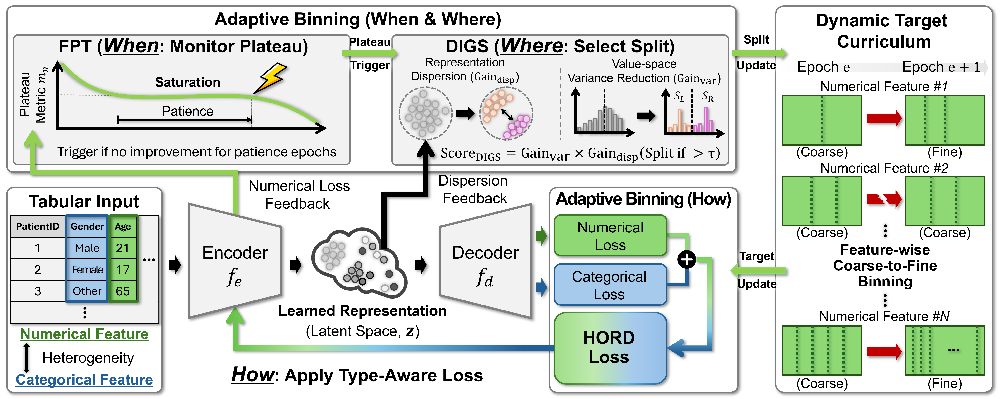

<h1 align="center">When, Where, and How: Adaptive Binning for Tabular Self-Supervised Learning</h1>

  <a href="https://scholar.google.com/citations?user=kqOWf4MAAAAJ"><strong>Daehwan Kim</strong></a>
  &nbsp;&middot;&nbsp;
  <a href="https://scholar.google.com/citations?user=O-oZnIwAAAAJ"><strong>Haejun Chung</strong></a>&dagger;
  &nbsp;&middot;&nbsp;
  <a href="https://scholar.google.com/citations?user=1rBh9xkAAAAJ"><strong>Ikbeom Jang</strong></a>&dagger;
   
  &dagger; Corresponding author

  

Official repository for the MICCAI 2026 paper

**When, Where, and How: Adaptive Binning for Tabular Self-Supervised Learning**

Accepted to *MICCAI 2026*.

## Abstract

*Medical tabular data are ubiquitous in clinical research, but deep learning for tables remains underexplored because reliable labels often require costly expert adjudication, even though structured clinical variables are routinely available in tabular form. Self-supervised learning can leverage these unlabeled tables, and recent binning-based pretexts offer a promising inductive bias, but existing objectives fix a single global quantile discretization and apply feature-agnostic supervision. We propose Adaptive Binning, a training-adaptive discretization pretext for tabular SSL that couples discretization to learning through a feature-wise coarse-to-fine curriculum. Motivated by the spectral bias of neural networks and the principles of curriculum learning, our method progressively refines discretization per feature upon plateau detection and selects representation-aware splits to jointly improve value-space concentration and representation-space coherence. A heterogeneity-aware objective unifies categorical reconstruction with ordinal supervision for numerical features, and experiments on public medical tabular datasets under unified evaluation protocols show consistent gains for linear probing and fine-tuning without dataset-specific discretization tuning. We further introduce a medical tabular SSL benchmark with standardized protocols to support reproducible progress in this underexplored domain.*

## Code

Code will be updated and released soon.

## BibTeX (to cite our paper)

TBU.

## Contact

For questions about the paper or code, please contact **Daehwan Kim**.

📧 [officialhwan@hanyang.ac.kr](mailto:officialhwan@hanyang.ac.kr)
